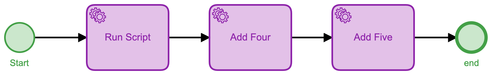
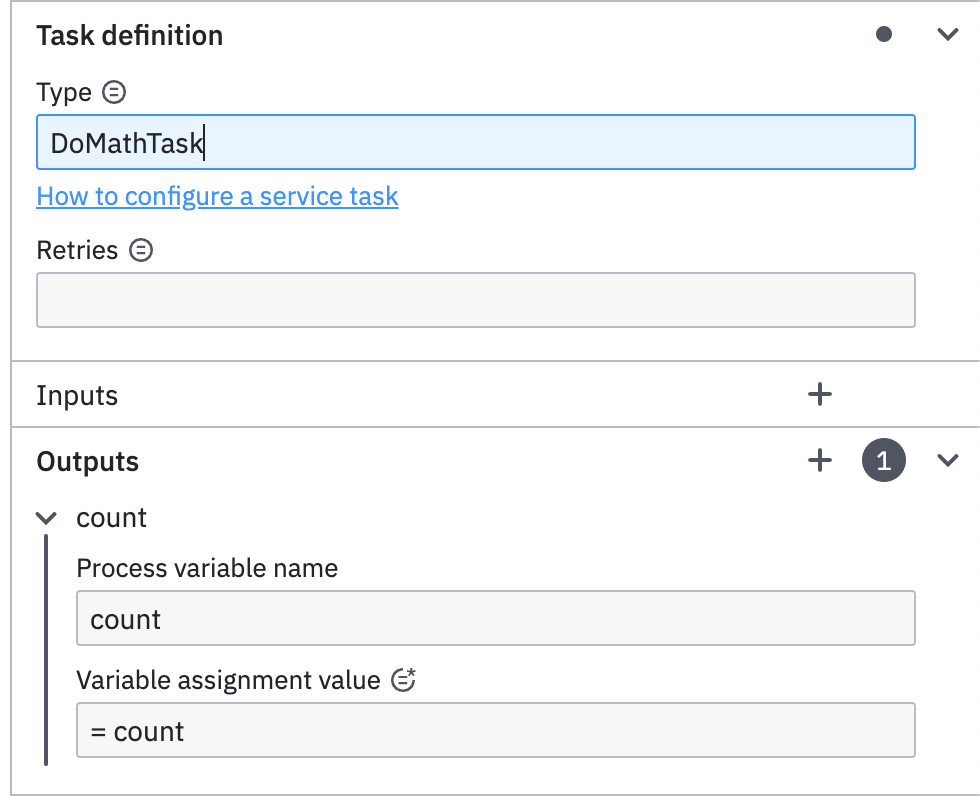
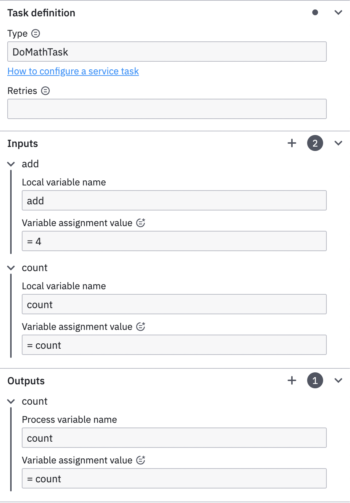

# Camunda Platform 8 Scripts

With Camunda Platform 7 it was possible to embed JavaScript directly within your models for simple (or even not so simple) tasks.

While this was not necessarily a 'best practice' and could make maintainability more difficult, it was a quick and easy way to have a simple script worker task that could perform some basic functions.

With Camunda Platform 8 (C8) this is no longer a possibility. There is no way to embed scripts in your models, so you'll need to come up with another way to handle these simple tasks.

## Some Examples

We thought it might be helpful to provide a few examples to show you how to do this in a couple of different languages. While these are very simplistic scripts, they should give you a clear idea of how to implement a task worker in the targeted languages.

## The Process

We have provided a simple BPN Process which you cna deploy and run directly to C8 to try out these client scripts.



This is a very simple 3-step process that will call your external task worker 3 times. If you deploy this process without any changes (and make no changes to the client programs provided) each client will be able to execute for each external task worker call.

If we look at the properties of the first task worker, called `Run Script`, we see that it will invoke a task worker called `DoMathTask`, it doesn't require any input variables, and it has one output variable called `count`.



If we look at the properties of the second task worker, `Add Four`, we see that it takes 2 inputs -- `count` and `add` and has one output again, `count`. But this time the inputs have values. It takes the `count` variable from the `Run Script` task, and will add 4 to it, returning the new `count`.



I'm sure you can guess what the `Add Five` task worker does, so we won't go through that one.

Now, on to the actual task workers.

## Supported languages

Camunda has 2 officially supported languages, as well as a number of community supported languages, that you can use to connect to C8. We have provided 4 example task workers, one in Go, one in Java, one in C#, and one in Node.js. Each of these task workers does the exact same thing. They will listen for the `DoMathTask` as defined in the process model, and execute that task with the variables given.

## [ The Go Task Worker](Golang/README.md)

## [ The Java Task Worker](Java/README.md)

## [ The C# Task Worker](CSharp/README.md)

## [ The NodeJS Task Worker](NodeJS/README.md)

## The Node.js client

The Node.js client is even shorter.

```js
const ZB = require('zeebe-node');

// Change this if you changed the task name in the BPMN file
const PROC_NAME = 'DoMathTask';
// change this to false for no output
const DEBUG = true;

if (DEBUG) {
  console.log("Starting Camunda Cloud Zeebe ScriptWorker")
  console.log("===================================")
}
  ; (async () => {
    const zbc = new ZB.ZBClient()
    zbc.createWorker(PROC_NAME, (job) => {
      if (DEBUG) {
        console.log("Handling job: ", job.key)
      }
      if (job.variables.count === undefined) {
        job.variables.count = 0
      }
      if (job.variables.add === undefined) {
        job.variables.add = 0
      }
      if (DEBUG) {
        console.log("Incoming variables: ", job.variables)
      }
      job.variables.count = job.variables.count + job.variables.add
      if (DEBUG) {
        console.log("Job Complete: ", job.variables)
      }
      job.complete(job.variables)
    })
  })()
```

Again, we define the task name to listen for, and then start a worker to listen for those tasks. We then get the process variables `count` and `add` (if they exist or we create them if they don't), add them together, and return the result.  Once again, to run this worker:

```shell
% export ZEEBE_ADDRESS=YOUR_CLUSTER.bru-2.zeebe.camunda.io:443
% export ZEEBE_CLIENT_ID=YOUR_CLIENT_ID
% export ZEEBE_CLIENT_SECRET=YOUR_CLIENT_SECRET
% npm install
% node test-script.js
```

If you then start a process instance in your C8 cluster, the Node.js task worker will handle it in exactly the same way as the Go task worker did.

> **Note:** Moke sure you stop the Go task worker before starting the Node.js task worker as you don't want the 2 task workers fighting over jobs.


## The Java Client


## The .Net (C#) Client

**Needs to be filled in**

## Conclusions

You can see how having some simple task workers to do jobs that you may repeat can be very useful. With this `DoMathTask` worker, I can send it 2 numbers and it will return the sum. You can compare between the various languages to see how each one performs the same task.